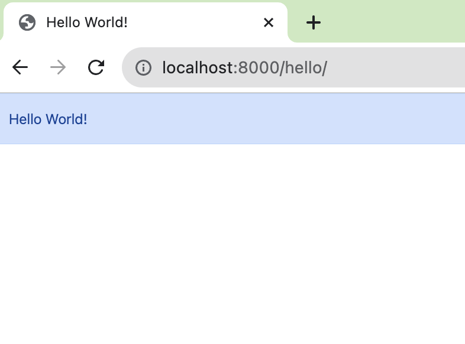

## Hi there 👋
<h1 align="center">
  <a href="https://git.io/typing-svg">
    
  </a>
</h1>


# 環境構築


## .envを作成し、以下を記載

SECRET_KEYは自身で生成する

[【Django】settings.pyのSECRET_KEYを再発行(リジェネレート)する](https://noauto-nolife.com/post/django-secret-key-regenerate/)

```.env
DATABASE_URL="postgres://postgres:postgres@db:5432/django_develop"
SECRET_KEY=<自身で生成したものを使う>
```

## dockerを立ち上げる

```
docker-compose up
```

ブラウザで[localhost:3000/hello](http://localhost:3000/hello)にアクセスし、以下の画面が表示されたら、構築完了。


